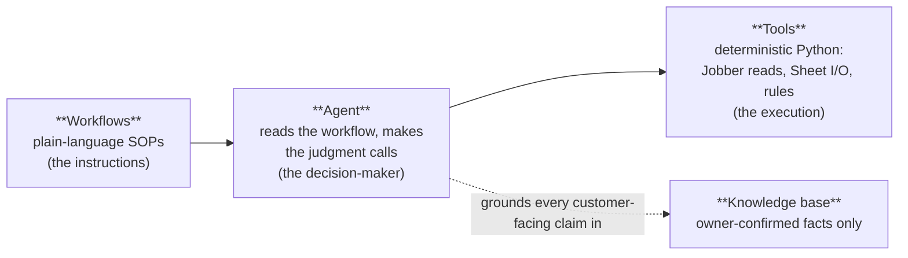
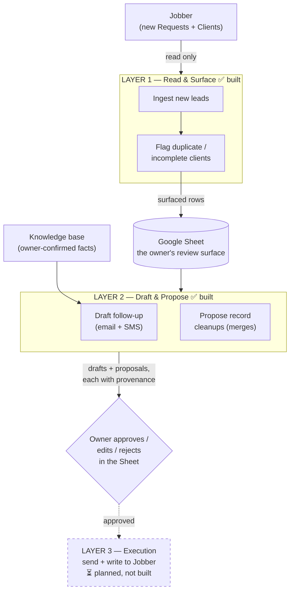

# Tradewind — an intelligent assistant layer on top of Jobber

> **Private / internal.** This repository is Nerumi IP and must remain private.

## What Tradewind is

Home-services businesses (plumbers, landscapers, fencing companies) run on **Jobber** — a CRM whose
funnel is *Request → Quote → Job → Invoice*. Their two recurring headaches are that **inbound leads and
follow-ups slip through the cracks**, and their **client data is messy** (duplicates, half-filled
records). **Tradewind is an intelligent layer that sits on top of Jobber**: it watches for new leads,
reads each one and the customer attached to it, flags duplicate and incomplete records, and **drafts a
reply in the owner's voice** — then waits. It **never changes data and never sends a message on its own**;
a human reviews and approves everything first. Think of it as a sharp assistant who prepares the work and
hands it to the owner to sign off, rather than a bot let loose on the business.

## The architecture — WAT (Workflows, Agents, Tools)

The system deliberately separates *thinking* from *doing*, because that separation is what makes it
reliable. If an AI tries to do every step itself, errors compound (five 90%-accurate steps ≈ 59% success).
So judgment lives in one layer and execution in another:

- **Workflows** — markdown playbooks describing each objective step by step.
- **Agent** — the AI. It reads the workflow and makes the probabilistic calls ("is this *likely* a
  duplicate?", "what should this reply say?").
- **Tools** — small, predictable Python scripts that do the exact, repeatable work.
- **Knowledge base** — the only place the agent is allowed to get facts about the business. If a fact
  isn't there, the agent **escalates instead of guessing**.

## How the pipeline flows

Everything above the dashed box exists today and is **read-only**. The actual *sending* and *writing to
Jobber* (Layer 3) is designed but deliberately **not built yet**.

## Layer progression & status

| Layer | What it does | Status |
|-------|--------------|--------|
| **Layer 1 — Read & Surface** | Polls new Jobber Requests, reads the linked Client, flags likely **duplicates** and **incomplete** records, writes everything to a Google Sheet for the owner. | **Built & verified** (read-only) |
| **Layer 2 — Draft & Propose** | For each lead, drafts a follow-up (email + SMS) grounded in the knowledge base, and proposes high-confidence record cleanups (e.g. "merge these two duplicate clients"). Both land in the Sheet with an **approve / edit / reject** control. | **Built & verified** (read-only) |
| **Layer 3 — Execution** | Once the owner approves, actually send the message and apply the change in Jobber. | **Planned — not built** |

> **Two honest caveats for review:**
> 1. **Everything built so far is strictly read-only** — Tradewind cannot currently change Jobber data
>    or message anyone. The OAuth permissions are *read-only by construction*.
> 2. **Nothing has run on real customer data yet.** It's been validated end-to-end against a test
>    sandbox and clearly-labeled **sample** data (see the demo below). The plumbing, detection, drafting,
>    and the approval surface are all proven; a real-account run is the next milestone.

## The safety design (why this is trustworthy, not reckless)

- **Least privilege.** The connection to Jobber requests *read-only* permissions; there is no
  send/message capability anywhere in the code. The Google connection is scoped to a single spreadsheet.
- **Reversible vs. irreversible.** Reading data and writing to the owner's review Sheet are reversible,
  so the agent does them on its own. Anything irreversible — changing Jobber, contacting a customer —
  **requires explicit human approval** and is the whole job of the (not-yet-built) Layer 3.
- **Never invents facts (grounding).** Every customer-facing claim — a price, a service, a policy — must
  come from the **owner-confirmed knowledge base**. If a lead asks something the knowledge base doesn't
  cover, the draft **escalates that question to the owner** instead of guessing. A built-in "grounding
  gate" **refuses to log a draft that cites an unconfirmed fact.**
- **The approval gate.** Drafts and proposals are surfaced with their **provenance** (which knowledge
  files back them) and a dropdown — *approved / edit / rejected*. Nothing proceeds without it, and an
  owner's edits are never overwritten by the system.
- **Sample data can't be sent.** Demo/sample knowledge is tagged as such; a draft grounded on sample
  facts is flagged `sample_grounded`, and Layer 3 must refuse to send those. Demo content can never
  masquerade as a real, confirmed fact.

## The working demo

To show the system without a live client, the knowledge base is filled with **fictional sample data for
a made-up landscaping company, "GreenLeaf Landscaping."** *(All `knowledge/` content is clearly labeled
sample data — `status: sample` — and is **not a real business**.)*

The demo makes the grounding guarantee visible with one lead asked twice:

- **Before the knowledge base is filled** → the draft refuses to quote prices or promise services it
  can't verify, and instead **escalates** those questions to the owner ("flagged for your input").
- **After the sample facts are loaded** → the *same lead, same pipeline* produces a **fully grounded
  draft** — warm, on-brand, with a clear next step — and records exactly which files each claim came from
  (`services.md`, `pricing.md`, `service-area.md`, `voice.md`).

Identical input; the only thing that changed the output from "escalate everything" to "ready to send" was
**confirmed knowledge**. That contrast *is* the product's reliability story.

## Roadmap — what's next

1. **Lead scoring / qualification (the validated next must-have).** Our first real market-validation
   interview — with a business in the **fencing** trade — surfaced a gap we hadn't built for: they're
   *capacity-constrained, not lead-starved* ("lots of customers, can't take them all"; "most Facebook
   leads are trash"). They don't need *more* leads, they need to know *which* leads to chase fast vs.
   politely defer. That ranking — by source, job scope, urgency, and service-area fit — is the gap
   between "nice tool" and "must-have." *(See [`research/`](research/) for the anonymized discovery
   notes.)* Still read-only.
2. **Layer 3 — execution.** Approved drafts get sent and approved cleanups get applied in Jobber — the
   first capability that can change data or reach a customer, and therefore the most carefully gated.

## For developers

- **[CLAUDE.md](CLAUDE.md)** — the architecture and the action-safety rules the agent operates under.
- **[workflows/](workflows/)** — the step-by-step SOPs: `ingest_and_surface.md` (Layer 1),
  `draft_and_propose.md` (Layer 2).
- **[tools/](tools/)** — the deterministic Python (Jobber reads, Sheet I/O, hygiene rules, the grounding
  gate, cleanup proposals).
- **[knowledge/](knowledge/)** — the owner-confirmed source of truth (currently GreenLeaf *sample* data).
- Secrets (`.env`, `credentials.json`, `*_token.json`) are **gitignored and never committed**; copy
  `.env.example` to `.env` and supply your own. Keep any repo containing real client data private.

## License

Proprietary — Nerumi internal. Not for distribution.
